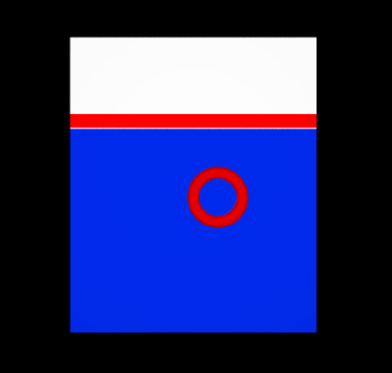

# Renderman Lookdev Project

The idea of this project is to try and do 1 hour a week look dev to replicate the MSc rendering project. I will take a simple scene (see image below) and try to recreate and model it using Renderman, OSL and Python.

For each hour I will make a branch to that the progress of the project can be seen as well as a write up [Report.md](Report.md)

## Basic Idea

The basic idea of this project came to me when I was on the ferry home and looked at the panel on the side of the ferry.


I noticed whilst quite a simple shape / surface it had very complex texture and material properties. Whilst this could be represented by a simple model of a plane and a torus (I will add pipes later) the materials were very complex.

I intend to model the following elements for the project which should provide enough of a challenge for the project, whilst at present I only have one image I will also get many more as I travel into work on the same ferry every day.

## Modeling

I have use a simple plane with a PxrRamp Pattern for the main plate and a torus for the porthole. This will do for the initial look development and I will add more when needed.

```
ri.AttributeBegin()
  ri.Pattern('PxrRamp','plateBase',
  {
    "int rampType" : [1],
    "int tile" : [0],
    "int useNewRamp" : [1],
    "int colorRamp" : [5] ,
    "color[5] colorRamp_Colors" : [1, 1, 1,1 ,0, 0, 1, 1 ,1 ,0 ,0.0228114408, 0.827000022, 1 ,1 ,1],
    "float[5] colorRamp_Knots" : [0.204839006 ,0.258064985, 0.306452006, 0.30806452, 1],
    "string colorRamp_Interpolation" : ["constant"],
  })
  ri.Attribute( 'user' , {'string __materialid' : ['mainplate'] })
  # simple bxdf for now
  ri.Bxdf ('PxrDiffuse' , 'mainplate', 
  {
      'reference color diffuseColor'  :['plateBase:resultRGB']  , 
      'string __materialid' : ['mainplate']
  })
  ri.Polygon({ 'P' : [-1 , 1 , 0, 
                       1 , 1 , 0, 
                       1,  -1.4 , 0, 
                      -1,  -1.4 , 0
                      ]})
  ri.AttributeEnd()


  ri.AttributeBegin()
  ri.Attribute( 'user' , {'string __materialid' : ['portHole'] })
  # simple bxdf for now
  ri.Bxdf ('PxrDiffuse' , 'portHole', 
  {
      'color diffuseColor'  : [0.8 ,0.0, 0.0] , 
      'string __materialid' : ['portHole']
  })
  ri.TransformBegin()
  ri.Translate(0.2 ,-0.3,0)
  ri.Torus(0.2,0.05,180,360,360)
  ri.TransformEnd()

  ri.AttributeEnd()

```

Which gives this



That's the end of the first hour.
