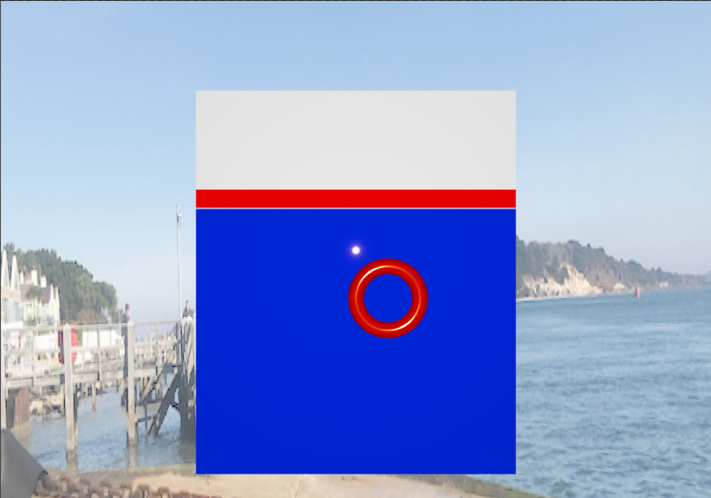

# Renderman Lookdev Project Hour 2


## Modeling

I have updated the model to use PxrSurface and a new DomeLight 
```
# now we start our world
ri.WorldBegin()
#######################################################################
#Lighting We need geo to emit light
#######################################################################
ri.TransformBegin()
ri.Rotate(-90,1,0,0)
ri.Rotate(180,0,0,1)
ri.Light( 'PxrDomeLight', 'domeLight', { 
          'string lightColorMap'  : 'lightMap.tex'
  })
ri.TransformEnd()
#######################################################################
# end lighting
#######################################################################

ri.AttributeBegin()
ri.Pattern('PxrRamp','plateBase',
{
  "int rampType" : [1],
  "int tile" : [0],
  "int useNewRamp" : [1],
  "int colorRamp" : [5] ,
  "color[5] colorRamp_Colors" : [1, 1, 1,1 ,0, 0, 1, 1 ,1 ,0 ,0.0228114408, 0.827000022, 1 ,1 ,1],
  "float[5] colorRamp_Knots" : [0.204839006 ,0.258064985, 0.306452006, 0.30806452, 1],
  "string colorRamp_Interpolation" : ["constant"],
})
ri.Attribute( 'user' , {'string __materialid' : ['mainplate'] })
# simple bxdf for now
ri.Bxdf ('PxrSurface' , 'mainplate', 
{
    'float diffuseGain' : [0.8],
    'reference color diffuseColor'  :['plateBase:resultRGB']  , 
    'int specularFresnelMode' : [1],
    'color specularEdgeColor' : [1 ,1 ,1],
    'color specularIor' : [4.3696842, 2.916713, 1.654698],
    'color specularExtinctionCoeff' : [0.1, 0.1, 0.1],
    'float specularRoughness' : [0.01], 
    'integer specularModelType' : [1], 
    'string __materialid' : ['mainplate'],
})
ri.Polygon({ 'P' : [-1 , 1 , 0, 
                      1 , 1 , 0, 
                      1,  -1.4 , 0, 
                    -1,  -1.4 , 0
                    ]})
ri.AttributeEnd()


ri.AttributeBegin()
ri.Attribute( 'user' , {'string __materialid' : ['portHole'] })
# simple bxdf for now
ri.Bxdf ('PxrSurface' , 'portHole', 
{
    'color diffuseColor'  : [0.8 ,0.0, 0.0] , 
        'float diffuseGain' : [0.8],
    'int specularFresnelMode' : [1],
    'color specularEdgeColor' : [1 ,1 ,1],
    'color specularIor' : [4.3696842, 2.916713, 1.654698],
    'color specularExtinctionCoeff' : [0.1, 0.1, 0.1],
    'float specularRoughness' : [0.01], 
    'integer specularModelType' : [1], 

    'string __materialid' : ['portHole']
})
ri.TransformBegin()
ri.Translate(0.2 ,-0.3,0)
ri.Torus(0.2,0.05,180,360,360)
ri.TransformEnd()
ri.AttributeEnd()
```

Which gives this



That's the end of the first hour.

# More reference.

Most of today has been about taking reference images and analyzing them for designing the shading networks I need.

As it was a sunny day I decided to take a quick panoram using my iPhone to use for the image map, whilst this is not ideal it is HDRI and allows a quick mock up of the lighting. 

I converted it using ```txmake -envlatl lightMap.exr  lightMap.tx``` and it produced this image


The following list shows some more reference and ideas about what I need to do to generate it. This will form the basis of the next few iterations.

## Detail 1


This first images show the different layers on the white section, you can see that some of the paint is gloss whilst other is matte so we need to change these (shiny) parameters. Also notice the displacement and holes in some areas, this is on the base metal so we need to simulate some form of displacement then pass this through all layers.

## Detail 2


This image shows holes in the surface a lot better, these are quite deep depressions with quite sharp edges so they can be generated via a displacement shader or a map. You can now also see the paint flecks which are the topmost level, these are quite matte so can be added using a procedural process and perhaps a simple diffuse shader.

We can also see the effects of the streaks and what I assume is salt spray / water on the surface. Again this can be added as a layer. Also transition between paint layers is quite rough so need to add noise for this.


## Detail 3


Note as it is bright today we have a definite Fresnel effect going on so we need to think how the glossy elements work. 

## Detail 4/5


There is a lot of deformation on the surface with the paint being very think and not drying correctly, this needs to be added using either normal maps or other procedural means, need to test.

Also note how the paint flecks mix.

## Detail 6


A closer look at the streaks, this can be produced with a simple line / noise shader then mixed with the other layers.

## Detail 7


The rest of the images are for reference but will feed into the overall design.

This is the end of Hour 2
