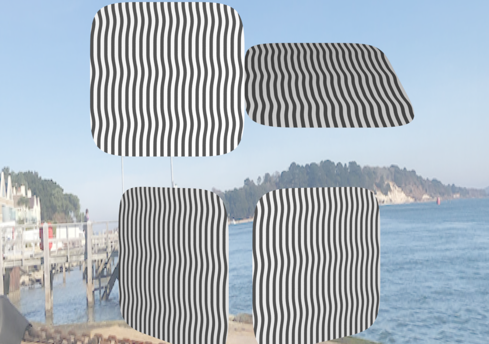

# Renderman Lookdev Project Hour 4

The issue with the displacements took a long time to find, it was due to setting the displacement shader after the mesh. As I was using ObjectInstance this made sense however it seems the displacement attribute was not getting passed to the mesh as it needed to be called first. 

I have now modified the test scene to use a subdiv surface as this work better with displacement's as well.




## Test scene

```
ri.AttributeBegin()

ri.Attribute ('trace' ,{'int displacements' : [ 1 ], "int autobias" : [1] ,"float bias" : [0.1]})

ri.Attribute ('displacementbound', {'float sphere' : [2], 'string coordinatesystem' : ['object']})

ri.Pattern('rustDisplace','rustDisplace', 
{ 
  'float dispScale' : [0.015],
  'float spread' : [12.638],
  'float pointSpreadX' : [510.0],
  'float pointSpreadY' : [210.0],
    
})


ri.Displace( 'PxrDisplace' ,'displacement' ,
{
  'int enabled' : [1],
  'float dispAmount' : [1.0],
  'reference float dispScalar' : ['rustDisplace:resultF'] ,
  'vector dispVector' : [0, 0 ,0],
  'vector modelDispVector' : [0, 0 ,0],
  'string __materialid' : ["mainplate"]
})

ri.Attribute( 'user' , {'string __materialid' : ['mainplate'] })
plate=ri.ObjectBegin()
ri.HierarchicalSubdivisionMesh("catmull-clark" ,[4 ,4 ,4 ,4, 4 ,4 ,4 ,4 ,4], 
  [4, 5, 1, 0, 5, 6, 2, 1, 6, 7, 3, 2, 8 ,9, 5, 4, 9 ,10 ,6 ,5 ,10, 11, 7, 6, 12, 13, 9 ,8 ,13, 14, 10, 9, 14, 15, 11, 10], 
  ["interpolateboundary"] ,[1 ,0 ,0] ,[2] ,[] ,[], 
  {"P"  : [-1, -1, 0 ,-0.333333, -1, 0 ,0.333333, -1, 0, 1 ,-1, 0,      -1 ,-0.333333 ,0, -0.333333, -0.333333 ,0 ,0.333333 ,-0.333333, 0, 1, -0.333333 ,0,
    -1, 0.333333 ,0, -0.333333 ,0.333333, 0, 0.333333, 0.333333 ,0, 1, 0.333333, 0,
    -1, 1, 0, -0.333333, 1 ,0 ,0.333333, 1, 0 ,1 ,1, 0,]} )


ri.ObjectEnd()
ri.Bxdf ('PxrSurface' , 'mainplate', 
{
  'color diffuseColor' : [0.6,0.6,0.6] ,
  'string __materialid' : ['mainplate']  
})
```

## Shader

Now have the beginnings of a shader based on this one https://thebookofshaders.com/edit.php#11/lava-lamp.frag needs more work.
```
surface rustDisplace (
              float spread=2.638,
              float pointSpreadX=1.0,
              float pointSpreadY=1.0,
              float dispScale=5.0,
              output float resultF=0
              )
{
float uu=u*pointSpreadX;
float vv=v*pointSpreadY;
vv *=pointSpreadX/pointSpreadY;
uu *=pointSpreadX/pointSpreadY;

point pos = point(uu,vv,0);

// Add a random position
vector vel = vector(spread);//vector(3.0*0.1);
float DF = snoise(pos+vel)*0.25+0.25;
float a= snoise(pos*vector(cos(3.0*0.15),sin(3.0*0.1)*0.1,0.0))*spread;

vel = point(cos(radians(a)),sin(radians(a)),0);
DF += snoise(pos+vel)*.25+.25;
resultF=-(smoothstep(.7,.75,DF-floor(DF)))*dispScale; //fract)
}
```


# More reference.

Most of today has been about taking reference images and analyzing them for designing the shading networks I need.

As it was a sunny day I decided to take a quick panoram using my iPhone to use for the image map, whilst this is not ideal it is HDRI and allows a quick mock up of the lighting. 

I converted it using ```txmake -envlatl lightMap.exr  lightMap.tx``` and it produced this image


The following list shows some more reference and ideas about what I need to do to generate it. This will form the basis of the next few iterations.

## Detail 1


This first images show the different layers on the white section, you can see that some of the paint is gloss whilst other is matte so we need to change these (shiny) parameters. Also notice the displacement and holes in some areas, this is on the base metal so we need to simulate some form of displacement then pass this through all layers.

## Detail 2


This image shows holes in the surface a lot better, these are quite deep depressions with quite sharp edges so they can be generated via a displacement shader or a map. You can now also see the paint flecks which are the topmost level, these are quite matte so can be added using a procedural process and perhaps a simple diffuse shader.

We can also see the effects of the streaks and what I assume is salt spray / water on the surface. Again this can be added as a layer. Also transition between paint layers is quite rough so need to add noise for this.


## Detail 3


Note as it is bright today we have a definite Fresnel effect going on so we need to think how the glossy elements work. 

## Detail 4/5


There is a lot of deformation on the surface with the paint being very think and not drying correctly, this needs to be added using either normal maps or other procedural means, need to test.

Also note how the paint flecks mix.

## Detail 6


A closer look at the streaks, this can be produced with a simple line / noise shader then mixed with the other layers.

## Detail 7


The rest of the images are for reference but will feed into the overall design.

This is the end of Hour 2
